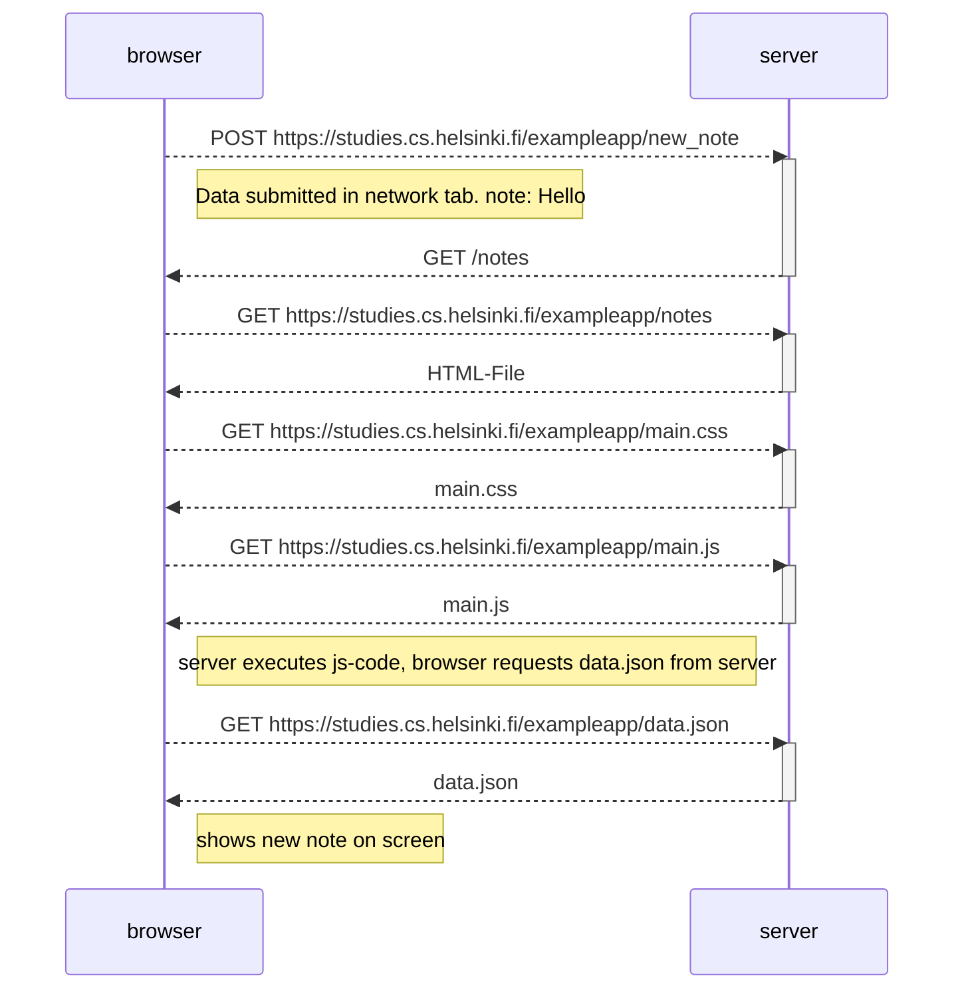

```mermaid

sequenceDiagram
    participant browser
    participant server
    
        browser-->>server: POST https://studies.cs.helsinki.fi/exampleapp/new_note
        activate server
    
        Note right of browser: Data submitted in network tab. note: Hello
    
        server-->>browser: GET /notes
        deactivate server
    
        browser-->>server: GET https://studies.cs.helsinki.fi/exampleapp/notes
        activate server
        server-->>browser: HTML-File
        deactivate server
    
        browser-->>server: GET https://studies.cs.helsinki.fi/exampleapp/main.css
        activate server
        server-->>browser: main.css
        deactivate server
    
        browser-->>server: GET https://studies.cs.helsinki.fi/exampleapp/main.js
        activate server
        server-->>browser: main.js
        deactivate server
    
        Note right of browser: server executes js-code, browser requests data.json from server
    
        browser-->>server: GET https://studies.cs.helsinki.fi/exampleapp/data.json
        activate server
        server-->>browser: data.json
        deactivate server
    
        Note right of browser: shows new note on screen
    
        
```
